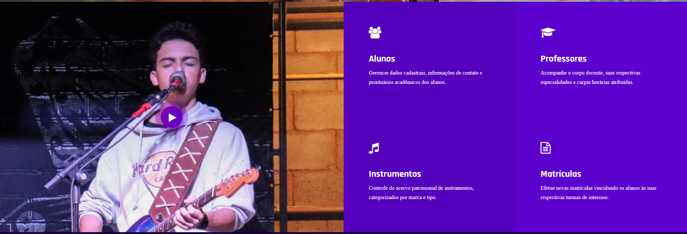

# Xavier Academy
 <div style="display: inline_block"><br>
  
  
  
  
  
</div>

#

Sistema web de gestão acadêmica para uma escola de música, desenvolvido como projeto final da disciplina **Programação de Sistemas para Web II (PSW II)** utilizando o framework **Django**, com implementação baseada na documentação oficial da Django Software Foundation e na adaptação do template DJoz.

---

# Interface inicial

A imagem abaixo apresenta uma das seções da tela inicial do sistema **Xavier Academy**, desenvolvida a partir da adaptação do template DJoz. Novas funcionalidades e telas serão adicionadas conforme o desenvolvimento do projeto.

<p align="center">
    
</p>

---

# Sobre o projeto

O **Xavier Academy** é uma aplicação web desenvolvida para simular o gerenciamento de uma escola de música, permitindo o cadastro e gerenciamento de alunos, professores, instrumentos, turmas e matrículas.

O projeto foi desenvolvido seguindo os requisitos da disciplina de **Programção de Sistemas para Web II**, contemplando modelagem orientada a objetos, banco de dados relacional, autenticação de usuários e interface responsiva.

---

# Funcionalidades

- Cadastro de alunos;
- Cadastro de professores;
- Cadastro de instrumentos;
- Cadastro de turmas;
- Matrícula de alunos em turmas;
- Visualização detalhada dos registros;
- Login e Logout de usuários;
- Controle de acesso utilizando autenticação do Django;
- Interface responsiva utilizando Bootstrap.

---

# Tecnologias utilizadas

- Python 3
- Django
- SQLite
- Bootstrap 5
- HTML5
- CSS3

---

# Documentação oficial do Django

Como prática de desenvolvimento adotada durante a disciplina de PSW II, este projeto foi implementado com base na documentação oficial do framework **Django**, priorizando a consulta às referências mantidas pela própria equipe do framework para estudo, implementação e validação das funcionalidades utilizadas.

**Referência:**
Django Software Foundation. *Django Documentation – Version 6.0.*
https://docs.djangoproject.com/en/6.0/

# Template base

A interface do sistema foi construída a partir do template gratuito **DJoz – Free Bootstrap Responsive Personal Portfolio Template for Musicians**, disponibilizado pela Themewagon, sendo posteriormente adaptado para a arquitetura Django e personalizado para atender às necessidades do sistema **Xavier Academy**.

**Template utilizado:**

https://themewagon.com/themes/free-bootstrap-responsive-personal-portfolio-template-djoz/

---

# Modelagem do sistema

O projeto possui as seguintes entidades:

- Usuário
- Aluno
- Professor
- Instrumento
- Turma
- Matrícula

### Relacionamentos implementados

- Pessoa (1:1) Usuário
- Pessoa (generalização) Aluno
- Pessoa (generalização) Professor
- Instrumento (1) Turma
- Professor (1) Turma
- Turma (1) Matrícula
- Aluno (1) Matrícula

A entidade Matrícula representa a associação entre Aluno e Turma, armazenando informações próprias do vínculo, como data da matrícula e status da matrícula (ativa, trancada ou cancelada).

Embora os relacionamentos implementados sejam do tipo 1, a entidade Matrícula funciona como uma classe associativa entre Aluno e Turma, representando logicamente um relacionamento N. Essa abordagem segue as boas práticas de modelagem de bancos de dados relacionais, permitindo registrar atributos específicos da matrícula sem duplicação de dados.

A utilização da entidade Pessoa como superclasse torna o modelo mais organizado, evita repetição de informações entre alunos e professores e facilita futuras expansões do sistema.

O diagrama de classes encontra-se disponível na pasta **imagens** do projeto:

```
imagens/diagrama_psw.png
```

---

# Estrutura prevista do projeto

> **Obs.:** A estrutura abaixo representa a organização planejada para o projeto. Novos diretórios, arquivos e recursos serão adicionados ao repositório conforme as novas instruções passadas pelo professor Carlos.

```
PSW-II-PROJETO-FINAL/

├── imagens/
│   ├── demonstracao_sistema.png
│   └── diagrama_psw.png
│── venv/
├── xavieracademy/
    ├── core/
│   └── static/
│   └── templates/
│   └── static/
│   └── xavieracademy/
│   └── db.sqlite3
│   └── manage.py
├── README.md
└── requirements.txt
```

---

# Como executar o projeto

## 1. Clone o repositório

```bash
git clone https://github.com/EllisCarvalho3/PSW-II-PROJETO-FINAL.git
```

Entre na pasta do projeto:

```bash
cd PSW-II-PROJETO-FINAL
```

---

## 2. Crie e ative o ambiente virtual

### Windows

```bash
python -m venv venv

venv\Scripts\activate
```

### Linux

```bash
python3 -m venv venv

source venv/bin/activate
```

---

## 3. Instale as dependências

```bash
pip install -r requeriments.txt
```

---

## 4. Execute as migrações

```bash
python manage.py makemigrations

python manage.py migrate
```

---

## 5. Crie um superusuário

```bash
python manage.py createsuperuser
```

---

## 6. Execute o servidor

```bash
python manage.py runserver
```

Depois acesse:

```text
http://127.0.0.1:8000/
```

---

# Autenticação

O sistema utiliza o mecanismo de autenticação nativo do Django (`django.contrib.auth`), permitindo:

- Login;
- Logout;
- Controle de acesso às funcionalidades protegidas.

---

# Requisitos do projeto atendidos

- ✔ Modelagem orientada a objetos;
- ✔ Diagrama de Classes;
- ✔ Banco de dados relacional;
- ✔ Relacionamentos entre entidades;
- ✔ Cinco CRUDs completos;
- ✔ Detail View em todos os módulos;
- ✔ Function-Based Views (FBVs);
- ✔ Autenticação utilizando `django.contrib.auth`;
- ✔ Interface responsiva desenvolvida com Bootstrap.

---

# Desenvolvedoras

Projeto desenvolvido como trabalho final da disciplina **Programação de Sistemas para Web II (PSW II)**.

**Instituto Federal Baiano – Campus Guanambi**

**Docente: Carlos Anderson Oliveira Silva**

**Curso Técnico em Informática para Internet**

Desenvolvido por:

- **Ellis Carvalho Xavier**
- **Anna Lívia Guimarães Magalhães**
